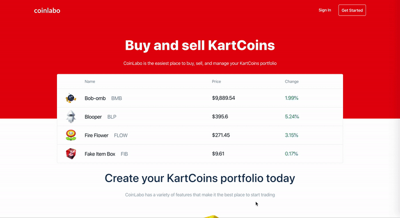
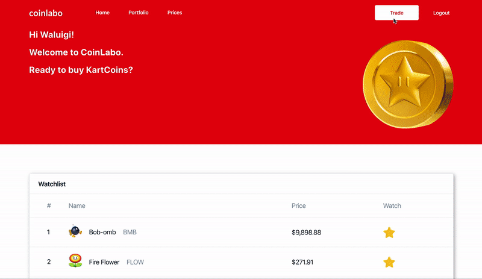

# CoinLabo

CoinLabo, a Coinbase clone, is a cryptocurrency investing application that allows users to purchase and sell cryptocurrencies listed on the Coinbase exchange.

[Live Demo](http://coinbase-aa.herokuapp.com/)

## Technologies

* Backend: Ruby on Rails/ActiveRecord/PostgreSQL
* Frontend: React/Redux
* [CryptoCompare API](https://min-api.cryptocompare.com/)
* [Recharts](http://recharts.org/en-US)
* SCSS

## Features

* Secure user authentication using BCrypt
* Personal dashboard displaying current asset holdings, transaction history, and watchlist
* Real-time and historical price data in USD of the top 19 crytocurrencies available on Coinbase
* Capability to simulate real time cryptocurrency trades with up to the second market price
* Interactive line charts display price data over time

## Dashboard & Portfolio

Upon sign in, the user is redirected to their dashboard which displays their cryptocurrency watchlist, portfolio and transaction history. An AJAX request is made upon DOM Content Loaded to fetch up to date prices.



## Cryptocurrency Show Page

The crytopcurrency show page displays a line chart showing daily closing price history over the last 90 days. A tooltip appears upon hover to show specific prices.


## Trade Component

The trade component to buy and sell crytocurrency is a modal that can be accessed from any page via the navigation bar. Frontend validation is applied (not enough units to sell, insufficient funds, etc.) to avoid unnecessary AJAX requests to the backend.



## Regex Validation

Adding commas to groups of three digits:
```javascript
export const addCommas = x => {
    let parts = x.toString().split(".");
    parts[0] = parts[0].replace(/\B(?=(\d{3})+(?!\d))/g, ",");
    return parts.join(".");
}
```

Validation for number of units to buy or sell:
```javascript
let pattern = new RegExp(/^\d*\.?\d*$/)
if (
    !pattern.test(e.currentTarget.value)
) {
    e.preventDefault;
}
```

## Fetching Cryptocurrency Data

The home dashboard contains three separate react components with their own data needs. This caused unnecessary logic complexity as these ajax requests would return in unpredictable orders. To solve this issue, I wrapped the four ajax requests with Promise.all to reliabley update Redux state once all promises have returned.

```javascript
export const fetchHomeData = () => dispatch => {
    Promise.all([
        PortfolioApiUtil.fetchPortfolio(),
        CryptoApiUtil.fetchCryptos(),
        TransactionApiUtil.fetchTransactions(),
        WatchlistApiUtil.fetchWatches()
    ])
        .then(allHomeData => dispatch(receiveHome(allHomeData)))
};
```

## Future Features

* Search feature for cryptocurrencies
* Pie chart displaying allocation of portfolio holdings
* Live update of prices without page refresh